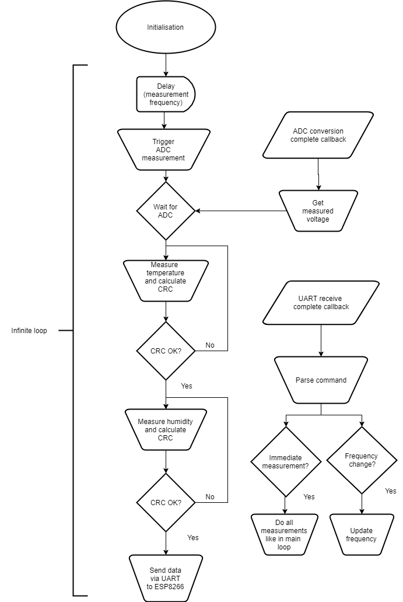

IoT node with STM32 MCU and ESP8266
===================================

This repository contains source code necessary to launch an IoT node with STM32
microcontroller and a ESP8266 WiFi module. This node is designed to measure
temperature and relative humidity with Si7021-A20 sensor and light intensity
with a photoresistor GL5537-1. The node is also capable to receive some commands
by filling a form available on the ESP8266.

## Table of Contents

<!-- TOC -->

- [IoT node with STM32 MCU and ESP8266](#iot-node-with-stm32-mcu-and-esp8266)
    - [Table of Contents](#table-of-contents)
    - [Hardware](#hardware)
    	- [STM32 Nucleo-F302R8](#stm32-nucleo-f302r8)
    	- [Si7021-A20 sensor](#si7021-a20-sensor)
    	- [ESP8266 NodeMCU](#esp8266-nodemcu)
    - [STM32 firmware](#stm32-firmware)
    	- [Creating a project](#creating-a-project)
    	- [Writing program](#writing-a-program)
    	- [Flashing target](#writing a program)
    - [Project description](#project-description)
    - [Connection](#connection)

<!-- /TOC -->

## Hardware

This section describes the hardware used in the project.

### STM32 Nucleo-F302R8

To build this node a STM32 microcontroller has been used. For prototyping and
developing purposes a STM32 Nucleo-F302R8 was chosen. One of the key features of
Nucleo boards is that they have on-board On-board ST-LINK/V2-1 debugger,
programmer with SWD connector. It allows to program on-board Nucleo or any other
STM32 microcontroller as well as debug running programs. Another feature is that
every pin of microcontroller is populated as a goldpin called STM Morpho.
In addition Nucleo supports Arduino connectivity by populating Arduino
compatible female pin headers.

? Nucleo boards can be programmed using just USB type mini B cable.

The microcontroller used on the Nucleo-F302R8 board has following features:

- LQFP64 package
- ARM®32-bit Cortex®-M4 CPU
- 72 MHz max CPU frequency
- VDD from 2.0 V to 3.6 V
- 64 KB Flash
- 16 KB SRAM
- GPIO (51) with external interrupt capability
- 12-bit ADC with 15 channels
- 12-bit DAC
- RTC
- Timers (6)
- I2C (3)
- USART (3)
- SPI (2)
- USB 2.0 FS
- CAN 2.0B
- Analog Comparators (3)
- Operational Amplifier

### Si7021-A20 sensor

Si7021-A20 is a relative humidity and temperature sensor created by	Silicon
Labs. It allows measuring temperature in range of -10 to 85 Celsius degrees and
relative humidity in range of 0 to 80 %. The sensor is communicating via I2C
protocol. Its datasheet is avaible in [Doc](Doc/Si7021-A20.pdf).

### GL5537-1 photoresistor

GL5537-1 is a photoresistor with 2MOhm dark resistance and 20-30kOhm resistance
at 10 lux light intensity. Measureing the light intensity is available by
measuring the photoresistor resistance and according to its illuminance vs.
resistance characteristics. The datasheet is available in
[Doc](Docs/GL55.pdf).

### ESP8266 NodeMCU

ESP8266 is a configurable WiFi module with many features. What makes this module
so useful is that it has its own SPI flash. This allows to flash custom firmware
on this module to run very complex applications. The firmware can be build using
the [NodeMCU builder site](https://nodemcu-build.com/index.php). User can feel
feel free to select modules to be included in the firmware to fit his needs.
For example in this project following modules were used:

- file
- net
- HTTP
- node
- timer
- UART
- WiFi
- websocket

The whole documentation of each module is available [here](http://nodemcu.readthedocs.io/en/master/).
Creating applications using these modules is done by writing scripts in LUA.
LUA interpreter is built in the firmware, which can be flashed into ESP8266
internal SPI flash using [NodeMCU Flasher](https://github.com/nodemcu/nodemcu-flasher)

There is also a special IDE for ESP8266 developers called [ESPlorer](https://github.com/4refr0nt/ESPlorer)
It is a comprehensive Java application allowing to debug, write LUA scripts and
download them to ESP8266 SPI flash.

## STM32 firmware

STM32 microcontrollers are complex ARM microcontrollers. Programming these ones
may seems to be difficult, but in this project a simplified method was used.
In this section creating a project, writing a program and flashing target will
be described.

### Creating a project

ST deliveres many tools to develop STM32 applications. The most important ones
are STM32CubeMX and AC6 System Workbench (Eclipse-based open source IDE).
They are available at ST official site and can be downloaded after registering
a free account.

STM32CubeMX is an appllication which allows generating whole project structure
wtih needed libraries and initialization code for target board. CubeMX supports
every single STM32 microcontroller. What it really does is to allow user to
specify target board, select needed peripherals, customize their configuration
and generate whole project with initialization code for target board.

The generated project can be imported into System Workbench workspace. The
generated code is ready to be compiled and downloaded to target board. Although
the infinite loop in main function is empty and the microcontroller will do
nothing. But at this state everything is ready for user to write his own code
for specific use-case.

The user code should be written between special markers e.g. `USER CODE BEGIN 1`
`USER CODE END 1`. If this convention is preserved, user can later run CubeMX,
change peripheral parameters or enable other peripherals and generate code again
without worries that something will be lost.

### Writing a program

As mentioned earlier the user code should be written between special markers to
prevent code loss during code generation in CubeMX. The programs on STM32
microcontrollers are written in HAL library nowadays. It is the newest driver
supported by ST. HAL stands for `Hardware Abstarct Layer`.

The whole description of HAL drivers are available [here](http://www.st.com/content/ccc/resource/technical/document/user_manual/2f/71/ba/b8/75/54/47/cf/DM00105879.pdf/files/DM00105879.pdf/jcr:content/translations/en.DM00105879.pdf)

### Flashing target

If the user program is ready it has to be built first. When compilation process
will finish with success, target board can be programmed by running the
application as an `AC6 STM32 C/C++ Application`.

> The target board must be connected with USB cable to ST-Link

## Project description

The STM32 NucleoF302R8 is responsible for collecting measurements, sending them
to ESP8266 and receiving commands from ESP8266.

The temperature and relative humidity is read from Si7021-A20 sensor using I2C
protocol. The 7-bit slave address is `0x40` but it has to be shifted left by 1
byte in order to be used correctly by I2C functions. The measurements are read
by sending following sequence on SDA line:

```
START-ADDR|W_BIT---COMMAND---R_START-ADDR|R_BIT--------------------------A-------A-----NA-STOP
-----------------A---------A--------------------A-clock_stretching-DATA1---DATA2---CRC--------
```

There is also an option to receive only data without checksum, master should
send NACK after second data byte and stop the transmission. A small trick is
done here - clock stretching. The slave holds the clock signal to force the
master to wait until the measurement is finished. Whean measurement is finished
slave releases the clock and transmission is resumed (data bytes plus optional
checksum is sent).

The checksum is checked against its correctness, and if the check fails, the
measurement is repeated. The checksum is a CRC8 code caclulated with initial
value of `0x00`. CHecksum is calculated using Dallas/Maxim variant of CRC8.

The light intensity is measured by measuring the voltage using ADC on 10KOhms
resistor connected in a voltage divider with photoresistor. Knowing the resistor
voltage and power supply voltage it is easy to calculate the circuit current and
so the photoresistor resistance.

Then the calculated resistance is converted to light intensity by using formula:

```
lux = 10^b * R^-m
```
Where:
- R is the photoresistor calculated resistance
- b and m are coefficients calculated form illuminance characteristics

The b and m coefficients were calculated simply using Excel and trend line. The
illuminance characteristics was translated to log10(lux) vs. log10(R) chart and
then the trend line was added. The raw formula for this chart was:

```
log10(lux)=−1.4×log10(R)+7.098
```

After some transforms one can obtain the final formula above.

The light measurement was done by ADC which was running in continuous conversion
mode. The measurement was set to be triggered by software in interrupt system so
the microcontroller would spent more time idle. Each time convertion was
complete, the voltage value was obtained and conversion was stopped until next
trigger.

A the end whole measurements were sent ES8266 via UART in following format:
```
Temp:%04.2fHum:%02dLight:%08.2f
```

The program also implements a method of receiving commands. It is done by
listening and waiting for a sequence of bytes on UART in interrupt mode.
Whenever a command was received a receive complete callback was called, command
content was parsed and measuring parameters were changed. For now the parameters
available to be changed are:
- frequency - 1/2/3/4 measurements per minute
- immediate measurement request

The flowchart of the microcontroller program:



<!-- TODO: describe ESP8266 application -->


## Connection
